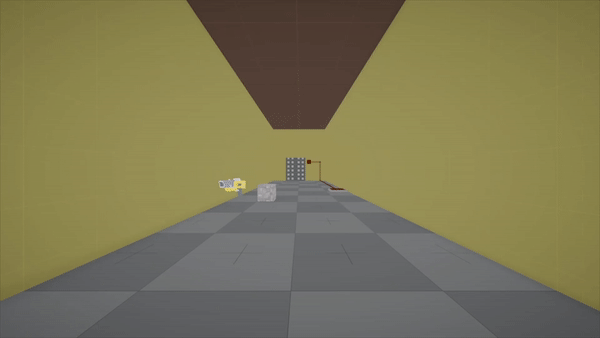

# Radial Jump

## Project

This is a first person Portal like game, where the player had to complete the successive rooms by resolving puzzles. The player have differents tools to complete the puzzles. The game is made with Unity during a course at the Gamagora computer science master degree in the University of Lyon II.

### Itch.io Link
https://nicovi.itch.io/radialjump

## Team
* Nicolas Vivier
* Wesley Petit
* Hugo Pasquier

## Images

### Room 1

### Room 2

### Room 3
